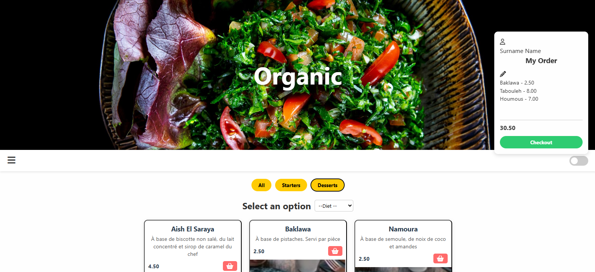

# Dark Kitchen – Interactive Restaurant Menu

This project is a small, interactive restaurant menu web application.  
It was an unfinished project, later enhanced with filters, light/dark mode, and a checkout sidebar.

The app displays starters and desserts, allows users to filter by category, select items to order, and see the total amount.

## Features

- Display meals as cards with images, title, description, and price
- Filter meals by category: All / Starters / Desserts
- Light/Dark mode toggle
- Add meals to a checkout sidebar and calculate total
- Responsive layout
- Future enhancement potential: diet filters (gluten free, lactose free, vegan), edit order, multiple quantities

## Tech Stack

- HTML / CSS / JavaScript (Vanilla)
- FontAwesome for icons
- DOM manipulation & event handling

## Styling

The project uses a simple modern layout with cards, hover effects, and a fixed aside for the order summary.  
Light and dark mode can be toggled with the switch in the header.

## Installation

Clone the repository:

```
git clone <your-repo-url>
cd dark-kitchen
```
Open `index.html` in your browser.  
No backend or database required.


## What I Learned

- DOM manipulation with vanilla JavaScript  
- Event handling and dynamic UI updates  
- Creating a responsive card layout  
- Handling state for selected meals and total calculation  
- Implementing a light/dark mode toggle  


## Future Improvements

- Activate the hamburger menu  
- Add diet filtering (gluten-free, lactose-free, vegan)  
- Enable multiple quantities and delete items from the order  
- Refactor meals into JSON or fetch from backend  


## Screenshots

  
   


## Live Demo

[View the project live here](https://alizee-dev.github.io/Dark-Kitchen/)

